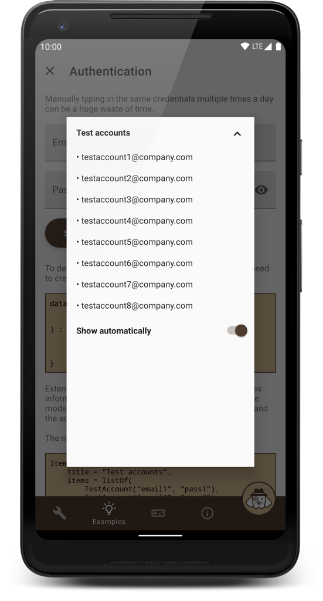
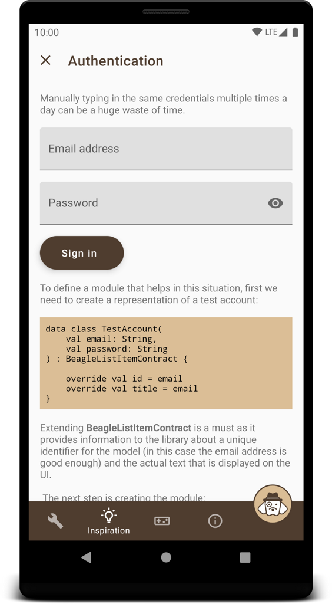
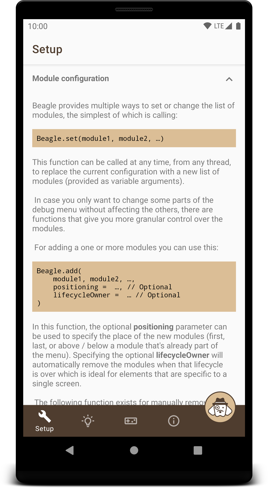
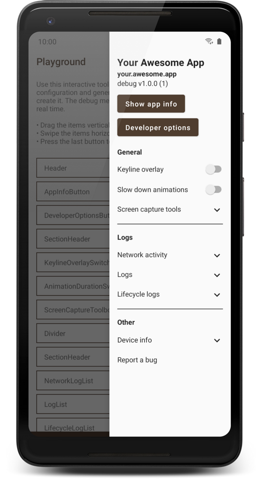

# Beagle (Android library)
*A smart, reliable, and highly customizable debug menu library for Android apps that supports screen recording, network activity logging, generating bug reports, and many other useful features.*


## Contents
- [See it in action](#see-it-in-action)
- [Use it in your project](#use-it-in-your-project)
    - [Step 0: Check the requirements](#step-0-check-the-requirements)
    - [Step 1: Add the Jitpack repository](#step-1-add-the-jitpack-repository)
    - [Step 2: Pick a UI implementation and configure the dependencies](#step-2-pick-a-ui-implementation-and-configure-the-dependencies)
    - [Step 3: Initialize the library](#step-3-initialize-the-library)
    - [Step 4: Finish the setup by adding modules](#step-4-finish-the-setup-by-adding-modules)
- [Advanced features](#advanced-features)
    - [Logging](#logging)
        - [Logging from pure Kotlin modules](#logging-from-pure-kotlin-modules)
        - [Logging with Timber](#logging-with-timber)
    - [Intercepting network events](#intercepting-network-events)
        - [OkHttp](#okhttp)
        - [Ktor (Android engine)](#ktor-android-engine)
    - [Displaying crash logs](#displaying-crash-logs)
    - [Improving encapsulation](#improving-encapsulation)
- [Troubleshooting](#troubleshooting)
    - [Crash on app launch](#crash-on-app-launch)
    - [Crash when opening a third party Activity](#crash-when-opening-a-third-party-activity)
    - [Gallery or Bug report screens having two toolbars](#gallery-or-bug-report-screens-having-two-toolbars)
- [Documentation](#documentation)
- [Changelog](#changelog)
- [Known issues](#known-issues)
- [Buy me a beer](#buy-me-a-beer)
- [License](#license)

## See it in action
Clone this repository, pick a build variant and run the **app** configuration. It should look something like this:



This demo application also contains instructions on how to set up Beagle and how to implement the various features that are being showcased. You should definitely consider giving it a try if you're interested in using the library in your projects. If you don't feel like building it for yourself, you can also download it from the Play Store:

[](https://play.google.com/store/apps/details?id=com.pandulapeter.beagle)

The tutorials in the app cover everything from this readme, but in more detail. Another way to get an idea of what can be achieved with the library is [this article](https://halcyonmobile.com/blog/mobile-app-development/android-app-development/what-could-a-debug-menu-contain/), which presents various problems that can be solved with Beagle.

## Use it in your project
If the wall of text below is too long for your taste, check out [this gist](https://gist.github.com/pandulapeter/3f9b404d953c6d80ed8a19eb06db4541) that contains all the code you need for a nice configuration. Otherwise, let's do it step by step:

### Step 0: Check the requirements
- Minimum SDK level: 16+
- Target SDK level: 30+
- Language: Kotlin 1.4.10 (should work with Java as well but the API was not optimized for that)

### Step 1: Add the Jitpack repository
Make sure that the following is part of your project-level build.gradle file:

```groovy
allprojects {
    repositories {
        …
        maven { url "https://jitpack.io" }
    }
}
```

### Step 2: Pick a UI implementation and configure the dependencies
The actual UI of the debug menu can be displayed in multiple ways, which is specified by the suffix of the dependency.
The following versions exist:
* **ui-activity** - Displays the debug menu as a new screen (not recommended: modals are more useful).
* **ui-bottom-sheet** - Displays the debug menu as a modal bottom sheet (recommended).
* **ui-dialog** - Displays the debug menu as a modal dialog (recommended).
* **ui-drawer** - Displays the debug menu as a side navigation drawer (highly recommended).
* **ui-view** - Displaying DebugMenuView is your responsibility (not recommended: shake to open, Beagle.show(), Beagle.hide(), the related VisibilityListener as well as the inset handling logic won't work out of the box).
* **noop** - No UI, no logic. It has the same public API as all other variants, but it does nothing (this is intended for production builds).

So, for example, if you prefer the Drawer UI, something like the following needs to be added to your app-level build.gradle file (check the widget below the code snippet for the latest version):

```groovy
dependencies {
    …
    def beagleVersion = "2.4.0"
    debugImplementation "com.github.pandulapeter.beagle:ui-drawer:$beagleVersion"
    releaseImplementation "com.github.pandulapeter.beagle:noop:$beagleVersion"
}
```

The latest version is:


[](https://jitpack.io/#pandulapeter/beagle)

**Note**: In case of the drawer UI, if you have overwritten the Activity's onBackPressed() method, you might notice that the default back navigation handling does not always work as expected. To fix this, in every Activity's onBackPressed() you should check that Beagle.hide() returns false before doing any other checks or calling the super implementation.

### Step 3: Initialize the library
Just one line of code, preferably in the Application's onCreate() method:

```kotlin
Beagle.initialize(this)
```

Optionally you can add the following parameters to this function:
* The appearance of the menu can be personalized by specifying an [Appearance](https://github.com/pandulapeter/beagle/blob/master/common/src/main/java/com/pandulapeter/beagle/common/configuration/Appearance.kt) instance. For example, here you can specify a custom theme for the debug menu using the **themeResourceId** parameter, in case the one used by the application is not suitable. Note: It's recommended to extend a *.NoActionBar* theme.
* The behavior of the menu can be personalized by specifying a [Behavior](https://github.com/pandulapeter/beagle/blob/master/common/src/main/java/com/pandulapeter/beagle/common/configuration/Behavior.kt) instance. Warning: by default Beagle can interfere with other crash reporting solutions, as it tries to handle uncaught exceptions by opening the bug reporting screen (of course this is not true for the noop artifact). If you want to disable this feature, use the **shouldCatchExceptions** parameter of the **BugReportingBehavior** class.

By default you can fetch Beagle by shaking the device.

### Step 4: Finish the setup by adding modules
After this a number of modules should be provided, but this configuration can be changed at any time (from any thread) and the UI will automatically be updated. The simplest way of doing this is by calling:

```kotlin
Beagle.set(module1, module2, …)
```
At this point you should be aware of two options:
* The list of [built-in modules](https://github.com/pandulapeter/beagle/blob/master/common/src/main/java/com/pandulapeter/beagle/modules/). Every file in this package is documented. These modules should cover most use cases and have the advantage of also providing a fake, **noop** implementation which means that no part of their logic is compiled into your release builds.
* The ability to write custom modules. For this a good starting point is looking at the built-in implementations from above, but [this document](https://github.com/pandulapeter/beagle/blob/master/metadata/CUSTOM_MODULES.md) also provides some guidance.

Check out [the showcase app](https://play.google.com/store/apps/details?id=com.pandulapeter.beagle) for some ideas on what is possible with the built-in modules or for an interactive tool that can be used to preview any module configuration and generate the code for it. A more visual guide to some of the possibilities is [this article](https://halcyonmobile.com/blog/mobile-app-development/android-app-development/what-could-a-debug-menu-contain/).

Here is a minimal example that should work for most projects:



```kotlin
Beagle.set(
    HeaderModule(
        title = getString(R.string.app_name),
        subtitle = BuildConfig.APPLICATION_ID,
        text = "${BuildConfig.BUILD_TYPE} v${BuildConfig.VERSION_NAME} (${BuildConfig.VERSION_CODE})"
    ),
    AppInfoButtonModule(),
    DeveloperOptionsButtonModule(),
    PaddingModule(),
    TextModule("General", TextModule.Type.SECTION_HEADER),
    KeylineOverlaySwitchModule(),
    AnimationDurationSwitchModule(),
    ScreenCaptureToolboxModule(),
    DividerModule(),
    TextModule("Logs", TextModule.Type.SECTION_HEADER),
    NetworkLogListModule(), // Might require additional setup, see below
    LogListModule(), // Might require additional setup, see below
    LifecycleLogListModule(),
    DividerModule(),
    TextModule("Other", TextModule.Type.SECTION_HEADER),
    DeviceInfoModule(),
    BugReportButtonModule()
)
```

## Advanced features
To take advantage of some of the library's more powerful features, additional setup is needed.

### Logging
While calling **Beagle.log()** is the simplest way to add items to [LogListModule](https://github.com/pandulapeter/beagle/tree/master/common/src/main/java/com/pandulapeter/beagle/modules/LogListModule.kt), a special workaround is needed to access this functionality from pure Kotlin modules. Another frequent use case is integration with [Timber](https://github.com/JakeWharton/timber).

#### Logging from pure Kotlin modules
To access the same functionality that Beagle.log() provides from a pure Kotlin / Java module, first you need to add the following to the module in question:

```groovy
dependencies {
    …
    api "com.github.pandulapeter.beagle:log:$beagleVersion"

    // Alternative for Android modules:
    // debugApi "com.github.pandulapeter.beagle:log:$beagleVersion"
    // releaseApi "com.github.pandulapeter.beagle:log-noop:$beagleVersion"
}
```

These libraries provide the **BeagleLogger** object which needs to be connected to the main library when it is initialized in the Application class:

```kotlin
Beagle.initialize(
    …
    behavior = Behavior(
        …
        logBehavior = Behavior.LogBehavior(
            loggers = listOf(BeagleLogger),
            …
        )
    )
)
```

To add log messages, now you can call the following:

```kotlin
BeagleLogger.log(…)
```

The messages list will be merged with the ones logged using the regular Beagle.log() function (unless they are filtered by their tags) and can be displayed using a [LogListModule](https://github.com/pandulapeter/beagle/tree/master/common/src/main/java/com/pandulapeter/beagle/modules/LogListModule.kt). You can also use BeagleLogger.clearLogs() if you cannot access Beagle.clearLogs().

#### Logging with Timber
To automatically add events logged with [Timber](https://github.com/JakeWharton/timber) to the debug menu, planting a special tree is the simplest solution:

```kotlin
Timber.plant(
    object : Timber.Tree() {
        override fun log(priority: Int, tag: String?, message: String, t: Throwable?) =
            Beagle.log("[$tag] $message", "Timber", t?.stackTraceToString())
    }
)
```

To create a special LogListModule that only displays these logs, simply set the **label** constructor parameter of the module to "Timber".

### Intercepting network events
Not bundling the network interceptor with the main library was mainly done to provide a pure Kotlin dependency that does not use the Android SDK, similarly to the logger solution described above. However, another reason was to provide the ability to choose between multiple implementations, in function of the project tech stack. At the moment Beagle can hook into two networking libraries to provide content for [NetworkLogListModule](https://github.com/pandulapeter/beagle/tree/master/common/src/main/java/com/pandulapeter/beagle/modules/NetworkLogListModule.kt), but manually calling **Beagle.logNetworkEvent()** is always an option.

#### OkHttp
Add the following to the module where your networking logic is implemented:

```groovy
dependencies {
    …
    api "com.github.pandulapeter.beagle:log-okhttp:$beagleVersion"
    
    // Alternative for Android modules:
    // debugApi "com.github.pandulapeter.beagle:log-okhttp:$beagleVersion"
    // releaseApi "com.github.pandulapeter.beagle:log-okhttp-noop:$beagleVersion"
}
```

This will introduce the **BeagleOkHttpLogger** object which first needs to be connected to the main library, the moment it gets initialized:

```kotlin
Beagle.initialize(
    …
    behavior = Behavior(
        …
        networkLogBehavior = Behavior.NetworkLogBehavior(
            networkLoggers = listOf(BeagleOkHttpLogger),
            …
        )
    )
)
```

The last step is setting up the Interceptor (the awkward casting is there to make sure the noop implementation does nothing while still having the same public API):

```kotlin
val client = OkHttpClient.Builder()
    …
    .apply { (BeagleOkHttpLogger.logger as? Interceptor?)?.let { addInterceptor(it) } }
    .build()
```

#### Ktor (Android engine)
Add the following to the module where your networking logic is implemented:
 
```groovy
dependencies {
    …
    api "com.github.pandulapeter.beagle:log-ktor:$beagleVersion"
    
    // Alternative for Android modules:
    // debugApi "com.github.pandulapeter.beagle:log-ktor:$beagleVersion"
    // releaseApi "com.github.pandulapeter.beagle:log-ktor-noop:$beagleVersion"
}
```

This will introduce the **BeagleKtorLogger** object which first needs to be connected to the main library, the moment it gets initialized:

```kotlin
Beagle.initialize(
    …
    behavior = Behavior(
        …
        networkLogBehavior = Behavior.NetworkLogBehavior(
            networkLoggers = listOf(BeagleKtorLogger),
            …
        )
    )
)
```

The last step is setting up the Logger (the awkward casting is there to make sure the noop implementation does nothing while still having the same public API):

```kotlin
val client = HttpClient(engine) {
    …
    (BeagleKtorLogger.logger as? HttpClientFeature<*,*>?)?.let { install(it) }
}
```
### Displaying crash logs
The library can intercept uncaught exceptions and display their stack trace in a dialog. Users will be able to share the crash report using the bug reporting screen that gets opened automatically. This functionality is achieved through a separate dependency that should be added to the main module (where Beagle is initialized):

```groovy
dependencies {
    …
    debugImplementation "com.github.pandulapeter.beagle:log-crash:$beagleVersion"
    releaseImplementation "com.github.pandulapeter.beagle:log-crash-noop:$beagleVersion"
}
```

After the dependencies are added, the newly introduced **BeagleCrashLogger** should be connected to the main library:

```kotlin
Beagle.initialize(
    …
    behavior = Behavior(
        …
        bugReportingBehavior = Behavior.BugReportingBehavior(
            crashLoggers = listOf(BeagleCrashLogger),
            …
        )
    )
)
```

The **log-crash** dependency introduces a Service running in a separate process. Firebase has a problem with this, so make sure you call the following in your Application class if you use Firebase:

```kotlin
FirebaseApp.initializeApp(this)
```

While this feature should work together with other crash reporting solutions, I do have some reliability concerns so please report any issues you encounter.

### Improving encapsulation

The `noop` implementations of every public artifact are the default ways of not including Beagle-related logic in your production releases. While this should be good enough for most projects, it can be improved by creating a separate wrapper module for the debug menu. This would mean hiding every call to Beagle behind an interface that has an empty implementation in release builds. This approach has its own benefits and drawbacks:

- **Advantages**
    - No Beagle imports outside of the wrapper module
    - Having a single entry-point to all features related to the debug menu
- **Disadvantages**
    - More cumbersome initial setup
    - Losing the ability to use Beagle features in pure Kotlin modules

## Troubleshooting

While the library is being battle-tested on multiple projects under active development, problems can always appear. These will always be restricted to internal builds thanks to the noop implementation not doing anything that can go wrong. Here are the issues you should know about.

### Crash on app launch
By default Beagle uses the current Activity's theme. Some modules require a Material theme to work, so if you have a crash caused by various theme attributes not being found, override the debug menu's theme with the **themeResourceId** property of the [Appearance](https://github.com/pandulapeter/beagle/blob/master/common/src/main/java/com/pandulapeter/beagle/common/configuration/Appearance.kt) instance provided during initialization with a Material theme.

### Crash when opening a third party Activity
Beagle works by adding a Fragment on top of every Activity's layout. Sometimes this is not necessary or not possible. While the library comes with a list of excluded Activity package names, you can manually add new entries to this list if needed, by using the **excludedPackageNames** property of the [Behavior](https://github.com/pandulapeter/beagle/blob/master/common/src/main/java/com/pandulapeter/beagle/common/configuration/Behavior.kt) instance provided during initialization.

### Gallery or Bug report screens having two toolbars
Set a **.NoActionBar** Material theme for the **themeResourceId** property of the [Appearance](https://github.com/pandulapeter/beagle/blob/master/common/src/main/java/com/pandulapeter/beagle/common/configuration/Appearance.kt) instance provided during initialization.

## Documentation
All public functions are documented with KDoc. The [BeagleContract](https://github.com/pandulapeter/beagle/blob/master/common/src/main/java/com/pandulapeter/beagle/common/contracts/BeagleContract.kt) file is a good start for learning about all the built-in capabilities. For information on the [individual modules](https://github.com/pandulapeter/beagle/tree/master/common/src/main/java/com/pandulapeter/beagle/modules), see the relevant class headers.

If you're interested in what's under the hood, [this document](https://github.com/pandulapeter/beagle/blob/master/metadata/DOCUMENTATION.md) can be helpful while navigating the source code. 

## Changelog
Check out the [Releases](https://github.com/pandulapeter/beagle/releases) page for the changes in every version.

The library uses [semantic versioning](https://semver.org): **MAJOR.MINOR.PATCH** where **PATCH** changes only contain bug fixes, **MINOR** changes add new features and **MAJOR** changes introduce breaking modifications to the API.

## Known issues
Check out the [Issues](https://github.com/pandulapeter/beagle/issues) page for the list of known problems and for the planned enhancements of the library.

Don't hesitate to open a new issue if you find a bug or if you have any questions / feature requests!

## Buy me a beer
If you found my work useful and are considering a small donation, the About section of the [the showcase app](https://play.google.com/store/apps/details?id=com.pandulapeter.beagle) has an option for you to do so. Thanks in advance!

## License
```
Copyright 2020 Pandula Péter

Licensed under the Apache License, Version 2.0 (the "License");
you may not use this file except in compliance with the License.
You may obtain a copy of the License at

   http://www.apache.org/licenses/LICENSE-2.0

Unless required by applicable law or agreed to in writing, software
distributed under the License is distributed on an "AS IS" BASIS,
WITHOUT WARRANTIES OR CONDITIONS OF ANY KIND, either express or implied.
See the License for the specific language governing permissions and
limitations under the License.
```