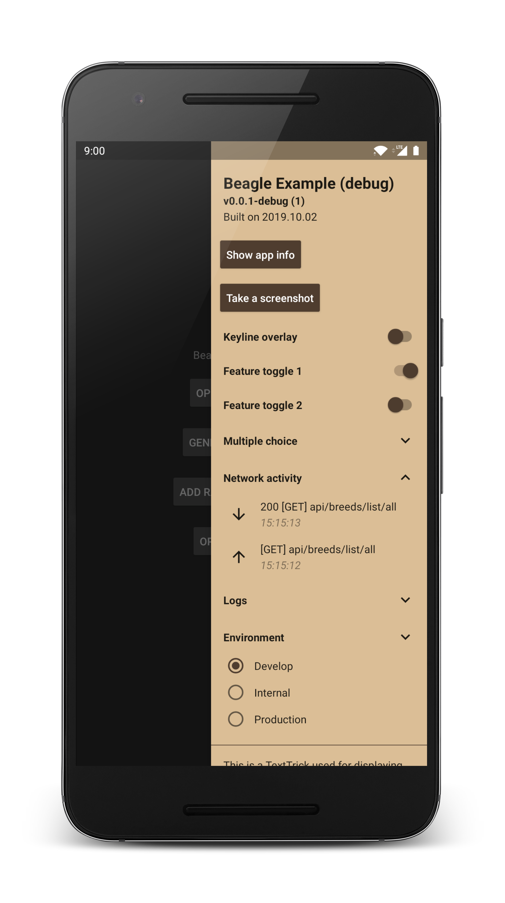

# Beagle (Android library)
*A smart and reliable companion library for debugging your Android apps*


### Usage
Add the following to your top level Gradle file:

```groovy
allprojects {
    repositories {
        …
        maven { url "https://jitpack.io" }
    }
}
```

...and this to the module-level build script (check the widget below the code snippet for the latest version):

```groovy
dependencies {
    …
    def beagleVersion = "1.4.5"
    debugImplementation "com.github.pandulapeter.beagle:beagle:$beagleVersion"
    releaseImplementation "com.github.pandulapeter.beagle:beagle-noop:$beagleVersion"
}
```

The latest version is:


[](https://jitpack.io/#pandulapeter/beagle)

The library has to be initialized with an Application instance (preferably in the Application's onCreate() method) by calling:

```kotlin
Beagle.imprint(this)
```
If the base package name of your project does not start with the application ID (for example if you're using product flavors) you should also specify the *applicationId* parameter of the imprint() function.

After this a number of modules (tricks) needs to be provided, but this can be changed at any time and the UI will be automatically updated. See [this implementation](https://github.com/pandulapeter/beagle/blob/master/example/src/main/java/com/pandulapeter/beagleExample/BeagleExampleApplication.kt) for a detailed example.

### Screenshots
 

### Tricks
Any number of generic modules can be added in any order as long as they have a unique ID:
* [Divider](/screenshots/moduleDivider.png) - Displays a horizontal line.
* [Padding](/screenshots/modulePadding.png) - Displays an empty space of specified size.
* [Text](/screenshots/moduleText.png) - Displays simple text content.
* [LongText](/screenshots/moduleLongText.png) - Displays a longer piece of text that can be collapsed into a title.
* [Image](/screenshots/moduleImage.png) - Displays a drawable.
* TODO: TextInput - Allows the user to enter free text.
* [Slider](/screenshots/moduleSlider.png) - Allows the user to adjust a numeric value.
* TODO: ColorPicker - Allows the user to pick a color.
* [Toggle](/screenshots/moduleToggle.png) - Displays a switch with configurable title and behavior - ideal for feature toggles.
* [Button](/screenshots/moduleButton.png) - Displays a button with configurable text and action.
* [KeyValue](/screenshots/moduleKeyValue.png) - Displays a list of key-value pairs that can be collapsed into a title.
* [SimpleList](/screenshots/moduleSimpleList.png) - Displays an expandable list of custom items and exposes a callback when the user makes a selection. A possible use case could be providing a list of test accounts to make the authentication flow faster.
* [SingleSelectionList](/screenshots/moduleSingleSelectionList.png) - Displays a list of radio buttons. A possible use case could be changing the base URL of the application to simplify testing on different backend environments.
* [MultipleSelectionList](/screenshots/moduleMultipleSelectionList.png) - Displays a lst of checkboxes.
* [LogList](/screenshots/moduleLogList.png) - Displays an expandable list of your custom logs. An example use case could be logging analytics events. Each item can be tapped for more information if you specified a payload. To log an event, simply call Beagle.log().

Unique modules can only be added once as they are specific to a single use case:
* [Header](/screenshots/moduleHeader.png) - Displays a header on top of the drawer with general information about the app / build.
* [KeylineOverlayToggle](/screenshots/moduleKeylineOverlayToggle.png) - Displays a switch that, when enabled, draws a grid over your app with configurable dimensions that you can use to check the alignments of your Views.
* [ViewBoundsOverlayToggle](/screenshots/moduleViewBoundsOverlayToggle.png) - Displays a switch that, when enabled, draws rectangles matching the bounds for every View in your hierarchy so that you can verify sizes and paddings.
* TODO: ForceRtToggle - Forces RTL layout orientation (on/off).
* [AppInfoButton](/screenshots/moduleAppInfoButton.png) - Displays a button that links to the Android App Info page for your app.
* [ScreenshotButton](/screenshots/moduleScreenshotButton.png) - Displays a button that takes a screenshot of the current layout and allows the user to share it.
* [ForceCrashButton](/screenshots/moduleForceCrashButton.png) - Displays a button that throws an exception when pressed - useful for testing crash reporting.
* TODO: StringGeneratorButton - Generates a string based on the user's preferences and copies it to the clipboard.
* TODO: SendBugReportButton - Sends a pre-formatted message with logs to a specified email address.
* [NetworkLogList](/screenshots/moduleNetworkLogList.png) - Displays an expandable list of historical network activity. Each item can be tapped for more information. To use this functionality, the custom beagleNetworkInterceptor needs to be added to the OkHTTP Client's builder, as implemented [here](https://github.com/pandulapeter/beagle/blob/master/example/src/main/java/com/pandulapeter/beagleExample/networking/NetworkingManager.kt).
* [DeviceInformationKeyValue](/screenshots/moduleDeviceInformationKeyValue.png) - Displays information about the current device and the OS.

The module list can be changed at any time (from any thread) using the following functions:

```kotlin
Beagle.learn(trick1, trick2, trick3...) // Remove all modules and add a new set
Beagle.learn(trick, positioning) // Add a single module or update it if it already is added
Beagle.forget(id) // Remove the specified module
```

See [this file](https://github.com/pandulapeter/beagle/blob/master/beagle-core/src/main/java/com/pandulapeter/beagleCore/configuration/Trick.kt) for documentation about every supported module.

### Tips and tricks
* The UI of the drawer can be personalized by specifying an [Appearance](https://github.com/pandulapeter/beagle/blob/master/beagle-core/src/main/java/com/pandulapeter/beagleCore/configuration/Appearance.kt) instance when initializing the library.
* The drawers can be disabled / enabled at runtime by modifying the value of Beagle.isEnabled. This could be useful if you want to restrict access to the debug drawer features based on user type.
* The library exposes the [BeagleListener](https://github.com/pandulapeter/beagle/blob/master/beagle-core/src/main/java/com/pandulapeter/beagleCore/contracts/BeagleListener.kt) interface that can be used to observe state changes. Make sure to always remove implementations that should be garbage collected.
* The library exposes the current Activity instance through the nullable, read-only Beagle.currentActivity property, which can be used to perform navigation actions in response to click events for example.

### Known issues
* Check the [Issues](https://github.com/pandulapeter/beagle/issues) page for further bugs.

### License
```
Copyright 2020 Pandula Péter

Licensed under the Apache License, Version 2.0 (the "License");
you may not use this file except in compliance with the License.
You may obtain a copy of the License at

   http://www.apache.org/licenses/LICENSE-2.0

Unless required by applicable law or agreed to in writing, software
distributed under the License is distributed on an "AS IS" BASIS,
WITHOUT WARRANTIES OR CONDITIONS OF ANY KIND, either express or implied.
See the License for the specific language governing permissions and
limitations under the License.
```