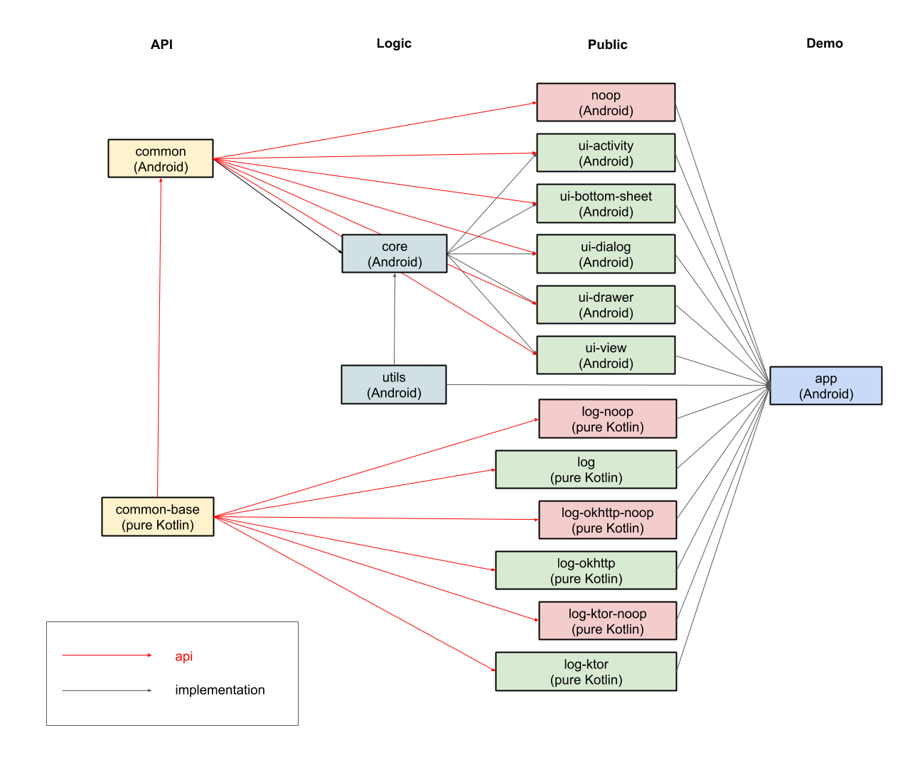

# How does it work?
This document provides some high-level insights into the inner workings of the library to make navigating the source code easier.

## Modules
The repository contains the following modules:

Only the modules in the **Public** column are exposed for public usage.

## Coming soon…
Concepts to describe:
 - RecyclerView adapter implementation with dynamically updated delegates
 - OverlayFragment